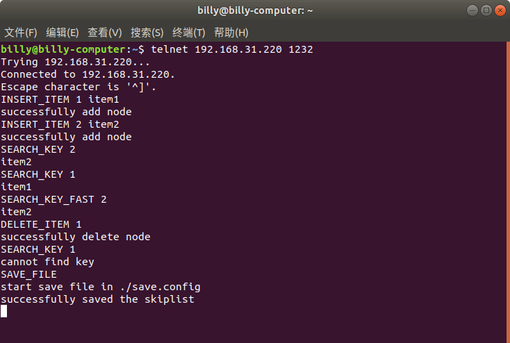

# Dummy skip list
The project has implemented a skip list. It is an effective tool for saving data. Each item contains a key and value. Because the data is saved in order,  the complexities of searching insertion and deletion are O(log n). Inspired by Redis, the data will also be saved in a hash map. On one hand, the hash map can provide a lower complexity of searching. But in another hand, a hash map also increases the complexity of insertion.  
## Usage
The project has two modes. You can include skiplist.h and use the interfaces that are provided by skiplist and write your program. In another way, you can also start the server mode and use a client to add or search items.    
We have two shell files to demonstrate the two modes.  
1. You can run performance_test.sh to test the performance of skiplist. The result is saved in performance_test_result.  
```
bash ./performance_test.sh
vim performance_test_result
```  
2. You can run server_mode.sh to start the server and use a client to send commands to the server.  
```
bash ./server_mode.sh
```  
Use client : telnet  
```
telnet [your IP] 1232
```
The interfaces for server mode are:  
```
SEARCH_KEY [key]  
SEARCH_KEY_FAST [key]  
INSERT_ITEM [key] [value]  
DELETE_ITEM [key]  
SHOW_SKIPLIST  
SIZE  
SAVE_FILE  
LOAD_FILE  
QUIT  
```
SEARCH_KEY means searching key by skiplist. SEARCH_KEY_FAST means searching key by hash map.  
Fig. 1 shows an example of using   
  
<center> FIg 1 </center>  

## Performance  
| threads | Element numbers (thousand) | Insert time (second) | Search time (second) | Search Fast time (second) | Size (thousand) |
|---------|----------------------------|----------------------|----------------------|---------------------------|-----------------|
| 1       | 10                         | 0.0683182            | 0.0409368            | 0.00461603                | 10              |
| 10      | 10                         | 0.0689253            | 0.0107727            | 0.00319926                | 10              |
| 1       | 100                        | 2.09585              | 6.68218              | 0.0566351                 | 100             |
| 10      | 100                        | 2.55082              | 1.18531              | 0.0312165                 | 100             |


Using the hash map to search the key can save time.  
## Todo
Using thread pools  
Using redirection for output instead of conditional compilation  
Automatically decide whether the hash map should be used
